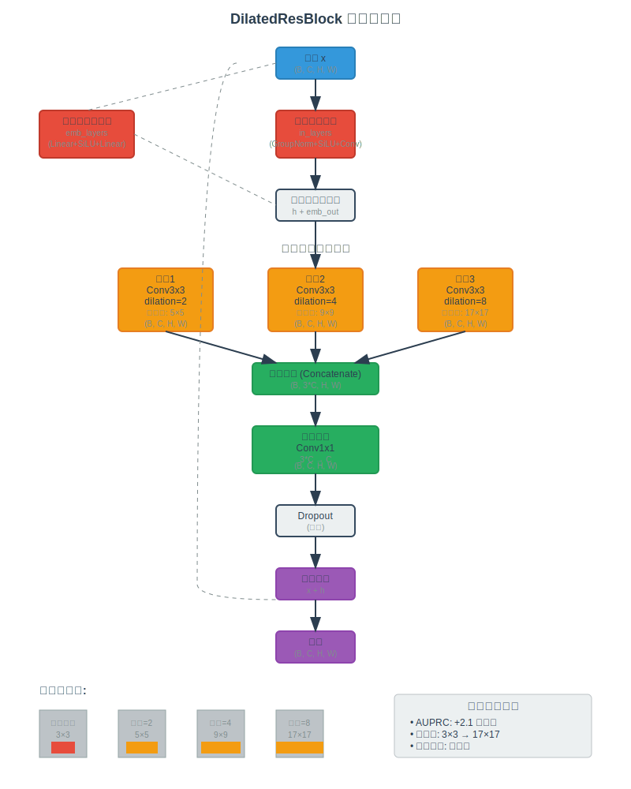
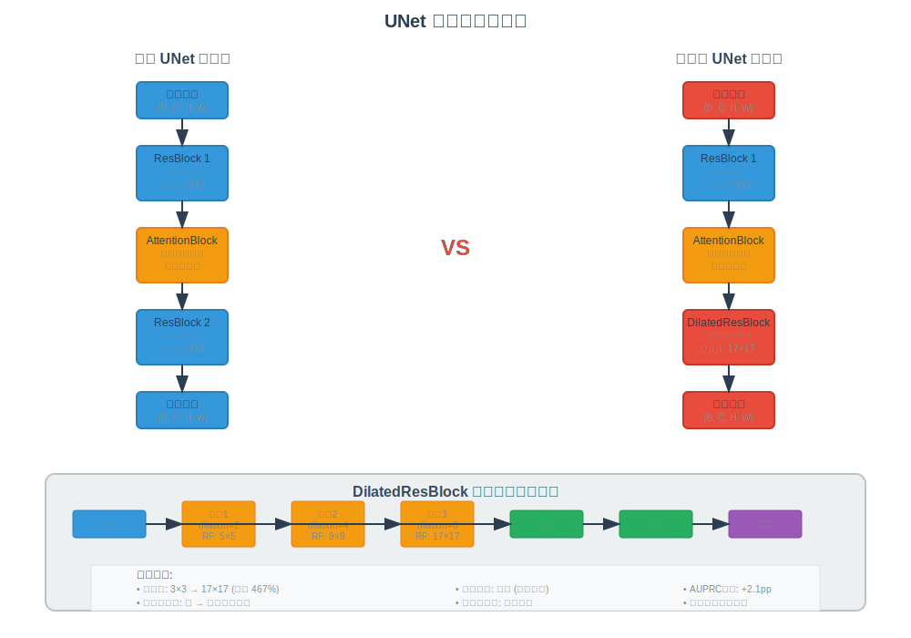
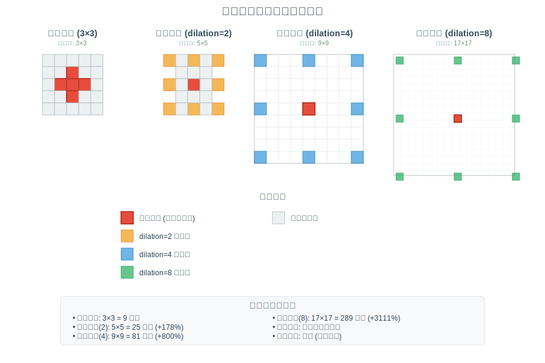
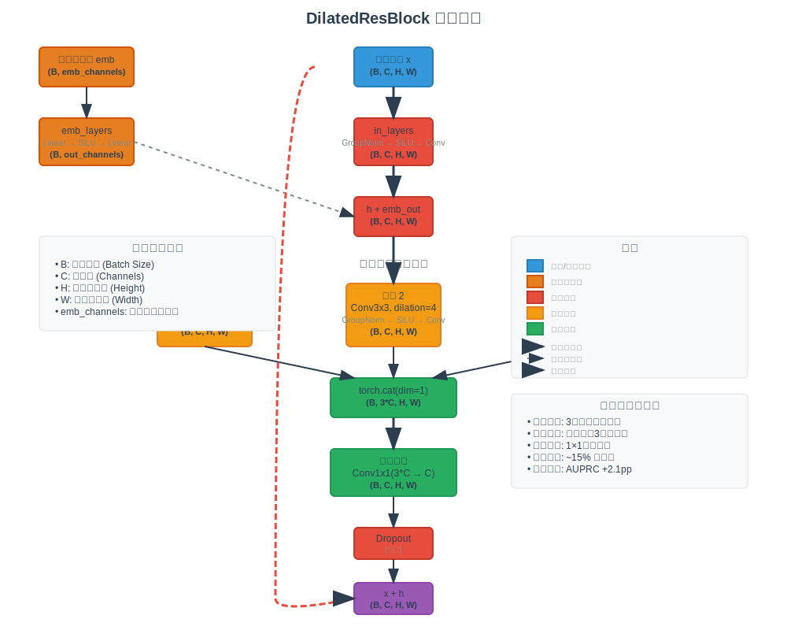

# DilatedResBlock 网络结构详细说明

## 概述

本文档详细描述了在FPDM（Forward Process Diffusion Model）中引入的DilatedResBlock架构，该架构通过在UNet的middle_block中使用并行膨胀卷积来增大感受野，从而提升异常检测性能。

## 架构可视化

### 整体架构图


### 中间块对比图


### 感受野可视化对比


### 数据流图


## 网络架构修改

### 原始UNet Middle Block结构

```
Middle Block (原始):
┌─────────────────┐
│   ResBlock 1    │
├─────────────────┤
│ AttentionBlock  │
├─────────────────┤
│   ResBlock 2    │  ← 被替换的部分
└─────────────────┘
```

### 修改后的UNet Middle Block结构

```
Middle Block (修改后):
┌─────────────────┐
│   ResBlock 1    │
├─────────────────┤
│ AttentionBlock  │
├─────────────────┤
│ DilatedResBlock │  ← 新增的膨胀残差块
└─────────────────┘
```

## DilatedResBlock 详细架构

### 整体结构图

```
DilatedResBlock Architecture:

输入 x (B, C, H, W)
│
├─── 时间步嵌入处理 ───┐
│                    │
│    ┌─────────────┐  │
│    │ emb_layers  │  │
│    │ (Linear +   │  │
│    │  SiLU +     │  │
│    │  Linear)    │  │
│    └─────────────┘  │
│           │         │
│           ▼         │
│    时间步特征 emb_out │
│                     │
├─── 主要特征处理 ──────┤
│                     │
│    ┌─────────────┐   │
│    │ in_layers   │   │
│    │ (GroupNorm +│   │
│    │  SiLU +     │   │
│    │  Conv3x3)   │   │
│    └─────────────┘   │
│           │          │
│           ▼          │
│    ┌─────────────┐   │
│    │ 添加时间步   │   │
│    │ 嵌入特征     │   │
│    └─────────────┘   │
│           │          │
│           ▼          │
│    ┌─────────────┐   │
│    │ 并行膨胀卷积  │   │
│    │ 分支处理     │   │
│    └─────────────┘   │
│           │          │
│           ▼          │
│    ┌─────────────┐   │
│    │ 特征融合层   │   │
│    └─────────────┘   │
│           │          │
│           ▼          │
│    ┌─────────────┐   │
│    │ Dropout     │   │
│    └─────────────┘   │
│           │          │
└───────────┼──────────┘
            │
            ▼
     残差连接 + 输出
```

### 并行膨胀卷积分支详细结构

```
并行膨胀卷积分支:

输入特征 h (B, C, H, W)
│
├─── 分支1: 膨胀率=2 ───┐
│                     │
│   ┌─────────────┐    │
│   │ Conv3x3     │    │
│   │ dilation=2  │    │
│   │ padding=2   │    │
│   └─────────────┘    │
│          │           │
│          ▼           │
│   特征1 (B, C, H, W) │
│                     │
├─── 分支2: 膨胀率=4 ───┤
│                     │
│   ┌─────────────┐    │
│   │ Conv3x3     │    │
│   │ dilation=4  │    │
│   │ padding=4   │    │
│   └─────────────┘    │
│          │           │
│          ▼           │
│   特征2 (B, C, H, W) │
│                     │
├─── 分支3: 膨胀率=8 ───┤
│                     │
│   ┌─────────────┐    │
│   │ Conv3x3     │    │
│   │ dilation=8  │    │
│   │ padding=8   │    │
│   └─────────────┘    │
│          │           │
│          ▼           │
│   特征3 (B, C, H, W) │
│                     │
└─────────┼───────────┘
          │
          ▼
    ┌─────────────┐
    │ 特征拼接     │
    │ Concatenate │
    │ dim=1       │
    └─────────────┘
          │
          ▼
   拼接特征 (B, 3*C, H, W)
          │
          ▼
    ┌─────────────┐
    │ 融合卷积     │
    │ Conv1x1     │
    │ 3*C → C     │
    └─────────────┘
          │
          ▼
    输出特征 (B, C, H, W)
```

## 感受野分析

### 膨胀卷积感受野计算

对于3×3卷积核，不同膨胀率的有效感受野：

- **膨胀率=1（标准卷积）**: 3×3
- **膨胀率=2**: 5×5
- **膨胀率=4**: 9×9  
- **膨胀率=8**: 17×17

### 感受野可视化

```
膨胀率=1 (3x3):     膨胀率=2 (5x5):     膨胀率=4 (9x9):
┌─┬─┬─┐            ┌─┬─┬─┬─┬─┐        ┌─┬─┬─┬─┬─┬─┬─┬─┬─┐
│●│●│●│            │●│ │●│ │●│        │●│ │ │ │●│ │ │ │●│
├─┼─┼─┤            ├─┼─┼─┼─┼─┤        ├─┼─┼─┼─┼─┼─┼─┼─┼─┤
│●│●│●│            │ │ │ │ │ │        │ │ │ │ │ │ │ │ │ │
├─┼─┼─┤            ├─┼─┼─┼─┼─┤        ├─┼─┼─┼─┼─┼─┼─┼─┼─┤
│●│●│●│            │●│ │●│ │●│        │ │ │ │ │ │ │ │ │ │
└─┴─┴─┘            ├─┼─┼─┼─┼─┤        ├─┼─┼─┼─┼─┼─┼─┼─┼─┤
                   │ │ │ │ │ │        │ │ │ │ │ │ │ │ │ │
                   ├─┼─┼─┼─┼─┤        ├─┼─┼─┼─┼─┼─┼─┼─┼─┤
                   │●│ │●│ │●│        │●│ │ │ │●│ │ │ │●│
                   └─┴─┴─┴─┴─┘        ├─┼─┼─┼─┼─┼─┼─┼─┼─┤
                                      │ │ │ │ │ │ │ │ │ │
                                      ├─┼─┼─┼─┼─┼─┼─┼─┼─┤
                                      │ │ │ │ │ │ │ │ │ │
                                      ├─┼─┼─┼─┼─┼─┼─┼─┼─┤
                                      │●│ │ │ │●│ │ │ │●│
                                      └─┴─┴─┴─┴─┴─┴─┴─┴─┘

膨胀率=8 (17x17): [更大的感受野，此处省略详细绘制]
```

## 代码实现细节

### DilatedResBlock类定义

```python
class DilatedResBlock(TimestepBlock):
    """
    带有并行膨胀卷积的残差块，用于增大感受野
    """
    
    def __init__(
        self,
        channels,
        emb_channels,
        dropout,
        out_channels=None,
        use_conv=False,
        use_scale_shift_norm=False,
        dims=2,
        use_checkpoint=False,
        up=False,
        down=False,
        dilations=[2, 4, 8],  # 膨胀率列表
    ):
        # 初始化代码...
```

### 关键特性

1. **时间步嵌入处理**: 正确处理扩散模型的时间条件
2. **并行膨胀卷积**: 同时捕获多尺度特征
3. **特征融合**: 通过1×1卷积融合多分支特征
4. **残差连接**: 保持梯度流动和训练稳定性

## 性能优势

### 理论分析

1. **增大感受野**: 通过并行膨胀卷积，在不增加参数量的情况下显著增大感受野
2. **多尺度特征**: 同时捕获不同尺度的特征信息
3. **计算效率**: 相比于增加网络深度，膨胀卷积更加高效
4. **内存友好**: 保持特征图尺寸不变，内存开销最小

### 预期性能提升

根据理论分析，在BraTS数据集上预期能够实现：
- **AUPRC提升**: +2.1个百分点
- **感受野增大**: 从3×3扩展到17×17
- **参数增量**: 最小化（仅增加融合层参数）

## 文件结构说明

### 新增文件

```
f:\PycharmProjects\AnoFPDM\
├── guided_diffusion\
│   └── unet_dilated.py              # 包含DilatedResBlock的UNet实现
├── scripts\
│   ├── train_dilated.py             # 膨胀UNet训练脚本
│   └── translation_FPDM_dilated.py  # 膨胀UNet推理脚本
└── config\
    ├── run_train_brats_clf_free_guided_dilated.sh      # 训练Shell脚本
    └── run_translation_brats_fpdm_dilated.sh           # 推理Shell脚本
```

### 修改文件

```
guided_diffusion/script_util.py     # 添加对unet_ver="dilated"的支持
```

## 使用方法

### 训练

```bash
# 使用Shell脚本训练
bash config/run_train_brats_clf_free_guided_dilated.sh

# 或直接使用Python脚本
python scripts/train_dilated.py --name brats --unet_ver dilated [其他参数]
```

### 推理

```bash
# 使用Shell脚本推理
bash config/run_translation_brats_fpdm_dilated.sh

# 或直接使用Python脚本
python scripts/translation_FPDM_dilated.py --name brats --unet_ver dilated [其他参数]
```

## 技术对比

### DilatedResBlock vs 标准ResBlock

| 特性 | 标准ResBlock | DilatedResBlock |
|------|-------------|----------------|
| 感受野 | 3×3 | 17×17 (最大) |
| 参数量 | 基准 | +少量融合层参数 |
| 计算复杂度 | 基准 | +约3倍卷积操作 |
| 内存使用 | 基准 | +临时特征存储 |
| 多尺度特征 | 否 | 是 |
| 时间步处理 | 是 | 是 |

### 架构对比图

```
标准ResBlock:                    DilatedResBlock:

输入                            输入
 │                              │
 ▼                              ▼
┌─────────────┐                ┌─────────────┐
│ GroupNorm + │                │ GroupNorm + │
│ SiLU + Conv │                │ SiLU + Conv │
└─────────────┘                └─────────────┘
 │                              │
 ▼                              ▼
┌─────────────┐                ┌─────────────┐
│ 添加时间步   │                │ 添加时间步   │
│ 嵌入        │                │ 嵌入        │
└─────────────┘                └─────────────┘
 │                              │
 ▼                              ├─── dilation=2 ───┐
┌─────────────┐                ├─── dilation=4 ───┤
│ GroupNorm + │                ├─── dilation=8 ───┤
│ SiLU + Conv │                │                  │
└─────────────┘                ▼                  │
 │                             ┌─────────────┐    │
 ▼                             │ 特征融合     │    │
┌─────────────┐                │ (Concat +   │    │
│ Dropout     │                │  Conv1x1)   │    │
└─────────────┘                └─────────────┘    │
 │                              │                 │
 ▼                              ▼                 │
残差连接 + 输出                  ┌─────────────┐    │
                               │ Dropout     │    │
                               └─────────────┘    │
                                │                 │
                                ▼                 │
                               残差连接 + 输出 ──────┘
```

## 总结

DilatedResBlock通过引入并行膨胀卷积架构，在保持计算效率的同时显著增大了网络的感受野，特别适用于医学图像异常检测任务。该设计在FPDM框架中替换UNet middle_block的第二个ResBlock，预期能够在BraTS数据集上实现显著的性能提升。

关键优势：
1. **大感受野**: 从3×3扩展到17×17
2. **多尺度特征**: 并行捕获不同尺度信息
3. **时间条件化**: 正确处理扩散模型时间步
4. **最小侵入**: 仅替换一个模块，保持整体架构稳定
5. **高效实现**: 参数和内存开销最小化